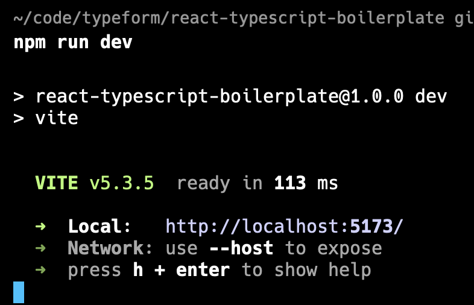
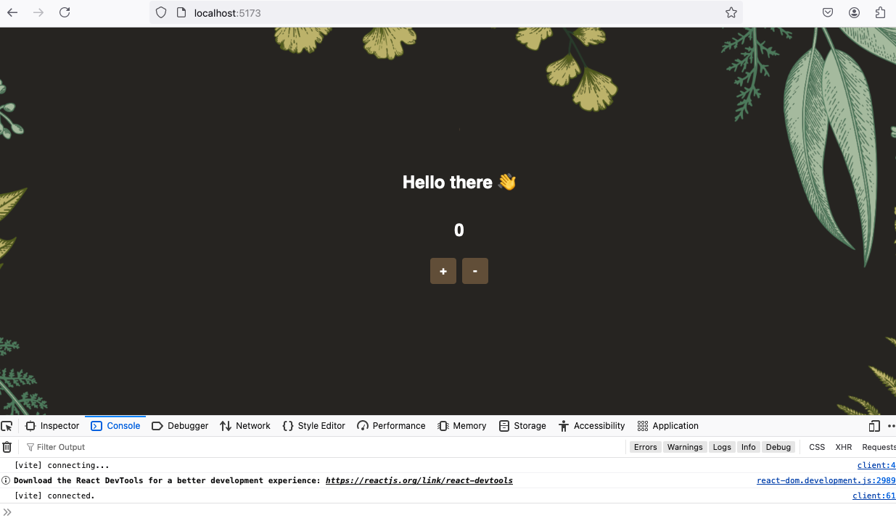
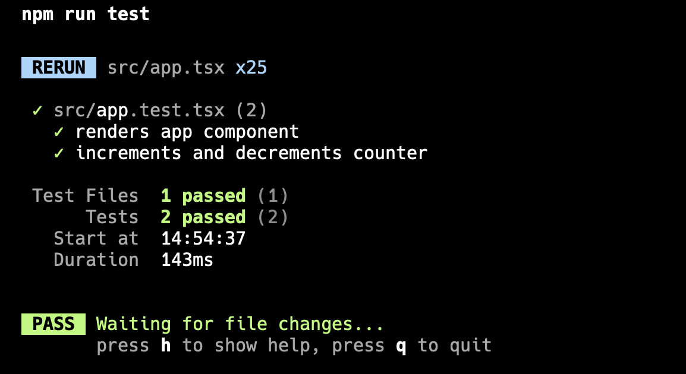

# react-typescript-boilerplate

Howdy 👋 This is a simple React + Typescript boilerplate it contains:

- A simple React component.
- A simple unit test with [@testing-library/react](https://testing-library.com/docs/react-testing-library/intro/).

## Prerequisites

Before running this repository, make sure you have the following installed on your machine:

1. Node.js (see `.nvmrc`)
2. npm (Node Package Manager)

## Installation

1. Clone the repository to your local machine.
2. Open a terminal and navigate to the project directory.
3. Run the command `npm install` to install the project dependencies.
4. Verify that the installation was successful by running the commands `npm run dev` and `npm run test`.

## Development Server

To start the development server, run the following command:

```
npm run dev
```

This will start the server and open the application in your default browser. You should see no errors or warnings, here's an example of what you should see in the terminal:



And here's what you should see in your browser:



## Running Tests

To run the tests, use the following command:

```

npm run test

```

This will execute the test suite and display the results in the terminal.



## License

This project is licensed under the [MIT License](LICENSE).

